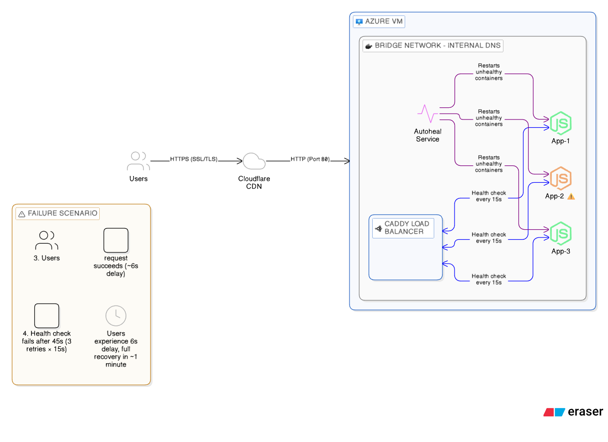

# 🚀 Resilient Server with Docker Compose

A production-ready, self-healing Node.js application with load balancing, automatic health checks, and container recovery using Docker Compose, Caddy, and Autoheal.

## 📋 Table of Contents

- [Features](#-features)
- [Architecture](#-architecture)
- [Quick Start](#-quick-start)
- [Domain Configuration](#-domain-configuration)
- [Common Errors & Solutions](#-common-errors--solutions)
- [Testing Resilience](#-testing-resilience)
- [Project Structure](#-project-structure)

## ✨ Features

- **Load Balancing**: Caddy automatically distributes traffic across 3 app replicas
- **Auto-Healing**: Unhealthy containers are automatically restarted
- **Health Checks**: Built-in health monitoring for all services
- **Dynamic Service Discovery**: Caddy discovers app containers automatically
- **Graceful Failover**: ~6 second failover when a container fails
- **Production Ready**: Optimized timeouts and retry logic

## 🏗️ Architecture



> **Note**: The architecture diagram shows the production setup with Cloudflare and custom domain. For security reasons, screenshots in this README use the local development setup (localhost:8888).

**Key Components:**
- **Cloudflare**: SSL/TLS termination, sends HTTP to origin (production only)
- **Azure VM**: Hosts all Docker containers (production) / Local Docker (development)
- **Caddy Load Balancer**: Distributes traffic across 3 app replicas
- **Node.js Apps**: 3 replicas for high availability
- **Autoheal**: Monitors and restarts unhealthy containers
- **Docker Network**: Internal communication between containers

## 🚀 Quick Start

### Prerequisites

- Docker & Docker Compose installed
- Git

### Local Development

1. **Clone the repository**
   ```bash
   git clone https://github.com/NeilNeel/server-resilient-way.git
   cd server-resilient-way
   ```

2. **Build and start the services**
   ```bash
   docker compose build
   docker compose up -d
   ```

3. **Access the application**
   - Open http://localhost:8888 in your browser
   - You'll see which container is serving your request

4. **Check container health**
   ```bash
   docker compose ps
   ```

### Production Deployment

1. **On your server, clone the repository**
   ```bash
   git clone https://github.com/NeilNeel/server-resilient-way.git
   cd server-resilient-way
   ```

2. **Update configuration for production**
   
   **a) Update port mapping in `compose.yaml`:**
   ```yaml
   lb:
     ports:
       - "80:80"  # Change from "8888:80" for production
   ```
   
   **b) Update Caddyfile for custom domain (optional):**
   
   Edit `lb/Caddyfile` - change the first line:
   ```caddyfile
   http://your-domain.com  # Change from ":80" for custom domain
   ```
   
   > ⚠️ **Security Note**: Never commit your actual domain name to public repositories if you want to keep it private. Use environment variables or keep this change local to your server.

3. **Build and deploy**
   ```bash
   docker compose build --no-cache
   docker compose up -d
   ```

## 📝 Configuration Summary

### Local Development Setup
- **Caddyfile**: `:80` (listens on all interfaces)
- **Port Mapping**: `8888:80` (access via localhost:8888)
- **Domain**: Not required
- **Cloudflare**: Not required

### Production Server Setup
- **Caddyfile**: `:80` (without custom domain) OR `http://your-domain.com` (with custom domain)
- **Port Mapping**: `80:80` (standard HTTP port)
- **Domain**: Optional, configure via Cloudflare
- **Cloudflare**: Required for custom domain with SSL

## 🌐 Domain Configuration

### Connecting a Custom Domain with Cloudflare

1. **Update Caddyfile**
   
   Edit `lb/Caddyfile` and change the first line:
   ```caddyfile
   http://your-domain.com
   
   respond /health-check "OK"
   # ... rest of config
   ```
   
   > **Important**: Use `http://` prefix to prevent HTTPS redirect loops with Cloudflare Flexible SSL

2. **Configure Cloudflare DNS**
   - Add an A record pointing to your server's IP address
   - Set **Proxy status**: ✅ Proxied (orange cloud)
   - Set **SSL/TLS mode**: Flexible

3. **Deploy the changes**
   ```bash
   git add .
   git commit -m "Configure domain"
   git push origin main
   
   # On server
   git pull
   docker compose down
   docker compose up -d
   ```

4. **Verify**
   - Visit `https://your-domain.com`
   - Check health endpoint: `https://your-domain.com/health-check`

### Why `http://` in Caddyfile?

When using Cloudflare with Flexible SSL:
- Cloudflare handles HTTPS for users
- Cloudflare connects to your server via HTTP
- Using `http://` in Caddyfile prevents Caddy from redirecting HTTP → HTTPS
- Without this, you'll get infinite redirect loops

## ⚠️ Common Errors & Solutions

### 1. Containers Keep Restarting (Health Check Failures)

**Symptom**: Autoheal constantly restarts all containers, logs show "found to be unhealthy"

**Cause**: `curl` is not installed in the app containers

**Solution**: 
```dockerfile
# In horrible-app/Dockerfile
RUN npm install && apk add --no-cache curl
```

Then rebuild:
```bash
docker compose build --no-cache app
docker compose up -d
```

> **Why this happens**: Alpine Linux (used in `node:22-alpine`) doesn't include curl by default. The health check command `curl -f http://localhost:3000` fails because curl doesn't exist.

### 2. "Too Many Redirects" Error

**Symptom**: Browser shows "ERR_TOO_MANY_REDIRECTS" when accessing via domain

**Cause**: Caddy is auto-redirecting HTTP → HTTPS, but Cloudflare is also redirecting

**Solution**: Use `http://your-domain.com` in Caddyfile (not just `your-domain.com`)

### 3. 504 Gateway Timeout Errors

**Symptom**: Requests timeout with 504 errors, especially when a container is slow

**Cause**: Caddy timeout settings are too aggressive

**Solution**: Already configured in `lb/Caddyfile`:
```caddyfile
lb_retries 3
lb_try_duration "15s"
lb_try_interval "1s"

transport http {
    dial_timeout "5s"
    write_timeout "5s"
    read_timeout "5s"
    response_header_timeout "5s"
}
```

### 4. Health Check Testing Wrong Endpoint

**Symptom**: All containers marked unhealthy even though they're working

**Cause**: Health check is testing external domain instead of localhost

**Solution**: Ensure health checks test the container itself:
```yaml
# App containers
healthcheck:
  test: curl -f http://localhost:3000 || exit 1

# Load balancer
healthcheck:
  test: curl -f http://localhost/health-check || exit 1
```

## 🧪 Testing Resilience

The app includes endpoints to test failure scenarios:

1. **Crash a container**
   - Visit: `http://localhost:8888/crash`
   - Container exits and restarts automatically

2. **Freeze a container**
   - Visit: `http://localhost:8888/freeze`
   - Container becomes unresponsive
   - Load balancer fails over to healthy containers (~6s)
   - Autoheal detects and restarts the frozen container (~45s)

3. **Mute a container**
   - Visit: `http://localhost:8888/mute`
   - Container stops responding without using CPU
   - Tests health check detection

4. **Heavy calculation**
   - Visit: `http://localhost:8888/heavy`
   - Runs 10-second calculation
   - Other requests still work (non-blocking)

## 📁 Project Structure

```
.
├── compose.yaml           # Docker Compose configuration
├── horrible-app/          # Node.js application
│   ├── Dockerfile        # App container image
│   ├── server.js         # Express server with test endpoints
│   └── package.json      # Node dependencies
├── lb/                   # Load balancer
│   ├── Dockerfile        # Caddy container image
│   └── Caddyfile         # Caddy configuration
└── README.md
```

## 🔧 Configuration Details

### Health Check Settings

- **Interval**: 15 seconds (how often to check)
- **Timeout**: 10 seconds (max time for check to complete)
- **Retries**: 3 (failures before marking unhealthy)
- **Start Period**: 10 seconds (grace period on startup)

**Detection time**: ~45 seconds (15s × 3 retries)

### Load Balancer Settings

- **Retries**: 3 attempts across different backends
- **Try Duration**: 15 seconds total
- **Try Interval**: 1 second between retries
- **Timeouts**: 5 seconds per operation

**Failover time**: ~6 seconds when a container is frozen

## 📝 License

MIT

## 🤝 Contributing

Pull requests are welcome! For major changes, please open an issue first.

---

**Built with** ❤️ **using Docker, Caddy, and Node.js**
